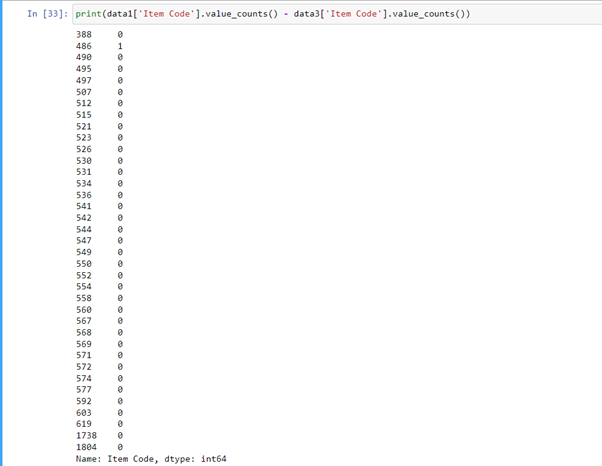

# Skill: Cleaning with Python

**Summary:** Python has multiple libraries and functions that can be used to process and clean data such as Pandas and NumPy. Cleaned data is easier to work with, perform analysis and create graphs from.

**Data formats in:** .csv, .xlsx, .json, .html, .xml, .tsv, etc… 
**Data formats out:** .csv, .tsv, .json, .html, .xml, .tex,, etc…

**Three tips:**
1. After converting missing or unknown values to the np.NaN data type, these can all be replaced with a particular value. This can be used to explain the context behind why a value is missing and then graphed in conjunction with other non-missing values. For example, if data contains missing values for a population voting preferences, the missing values can be labelled ‘No preference’ if the original survey instructed people to not pick a particular party if they had no affiliation. Later in a graph this can labelled as opposed to just being empty.  
`df = df.fillna(‘No preference’)`  
2. Normalising text to be the same case helps with certain data exploration and analysis tasks. If the data is originally manually entered, it is expected that certain conventions may not stay the same. For example, the entries “tomato” and “Tomato” refer both to the same thing but in a count may be labelled as being different. To fix this, we can change all cells to be lower, upper or capitalised using python’s built-in functions.    
`df[‘Party’] = df[‘Party’].str.upper()`  
3. Before merging data, the .value_counts() method can be used to look for inconsistencies between datasets. It can be used to provide a count of all the entries and subtract them from another dataset. If they line up perfectly, there should be no issues with merging and no data loss, otherwise this can be investigated.  
`data1['Item Code'].value_counts() - data3['Item Code'].value_counts()`  

**Examples of use:**

**Contribution to data analytics pipeline:** Cleaning with Python will be primarily used in the processing stage of the data analytics pipeline. Here the data that is gathered will be cleaned and processed before it can be used for the analysis stage.  

**Comment on your skill level:** I believe that my skill level is a 7/10 in regard to cleaning with python. I have a solid grasp on the basics and while I still forget the syntax and arguments for many methods, this will come with more time and practice. I haven’t yet tried some of the more advanced functions like creating pivot tables.  
