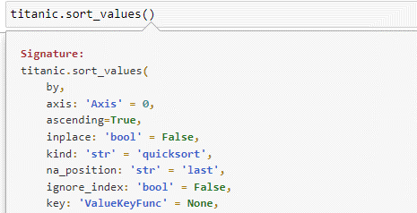

# Jupyter Notebooks

**Summary:** : Jupyter Notebooks are a web-based development environment that can be used for code and data processing/cleaning/exploring and analysing. It can be used on a machine locally and requires no internet or on a server.

**Data formats in**  .ipynb, text files(.txt, .csv, .tsv etc…)  
**Data formats out**  .ipynb, text files(.txt, .csv, .tsv etc…)  

**Three tips:**  
1. Pressing ESC turns on command mode and then pressing h brings up the keyboard shortcuts for Jupyter. These can be used to improve productivity and speed. Some of my favourite shortcuts when command mode is activated are m to change a cell to markdown and y to turn a cell into code. Shift + Enter to run a cell and move below and lastly Crtl + Enter to run selected cells.  
2. If you forget what arguments a certain method takes or what the defaults are, you can simply press Shift + Tab to get a pop-up with documentation for the respective method.
3. To insert mathematical equations into your code, you can turn on math mode in a markdown cell using `$$` and closing it with `$$`. Inside this you can use LaTeX notation and this can include mathematical equations, formulas etc… and is particularly useful in machine learning to explain an algorithm.

**Examples of use:**  
  
**Example of seeing different arguments in a method**
  
**Example of mathematical notation in a jupyter notebook**

**Contribution to data analytics pipeline:** Jupyter notebooks would mainly be used in the processing and analysing stages but can also be used during the gathering and presenting stage. You can show the process for cleaning a dataset within a Jupyter notebook and analyse that data within the notebook as well. It will all be documented in a step-by-step process. For the gathering phase you can also import data or scrape it within a notebook as it’s essentially just an environment for you code. Lastly for the presenting phase, you can also export/show visualisations in a notebook, and they can be used to present code or algorithms that fulfil a particular function.  

**Comment on your skill level:** I think my skill level with Jupyter is 7/10. I think I have a grasp on many of the functionalities and most-used shortcuts. However, I know Jupyter also supports many extensions, and I haven’t tried any yet. To improve my skill level, I think I should research the most popular ones and try them out for my next project.
