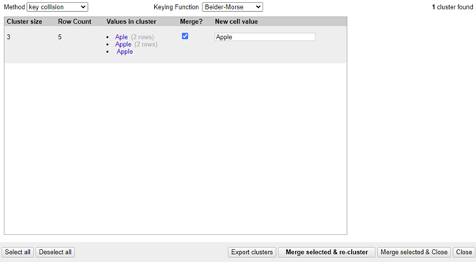

# Open Refine 

**Summary:** OpenRefine is an open-source data cleaning and exploration software. It runs locally on your computer with a small server and through a web browser. It is previously known as Google Refine as Google decided to no longer maintain the software.  

**Data formats in**  .tsv, .csv, .xls, .xlsx, .json, .xml, Google Sheets  
**Data formats out**  .tsv, .csv, .xls, .xlsx, .html, Google Sheets  

**Three tips:**  
1. By applying a numeric facet to a column, you can examine the rough distribution and range of your data through the histogram. By moving the sliders to the edges, you can quickly locate outliers within your data and examine whether they could be mistakes or just outliers to the norm.  
2. A common operation is to remove leading and trailing whitespaces that could mess with the analysis of data as this could be an inconsistency within certain cells. A very fast and efficient way of carrying out this common data-cleaning task in OpenRefine is selecting the **column – Edit cells – Common trnasformations – Trim leading and trailing whitespace**. In the same menu you can also **Collapse consecutive whitespace** which removes multiple spaces and can be another common data consistency error.
3. Applying a text facet and clustering the results can quickly show you cells that very similar. This can be useful when you know data is entered manually and due to human error, mistakes like spelling or format are expected. In the example below, there’s a dataset of fruit and you can clearly see there’s multiple misspellings that very similar to ‘apple’. With OpenRefine I can turn all these values in the cluster to the proper spelling of ‘apple’. 

**Examples of use:**   
**Example of clusters in Openrefine**

**Contribution to data analytics pipeline:** OpenRefine is mostly used in the in the Processing phase. You are able to perform a myriad of common data transformations very easily in OpenRefine and even write small functions to complete more complex ones. Once you’re done, you can export the cleaned data to an appropriate data format.

**Comment on your skill level:** I believe my skill level with OpenRefine is 6/10. I know how to use the facets but I haven't tried to code my own functions. I think I'd need to try this out to improve my skill level. 