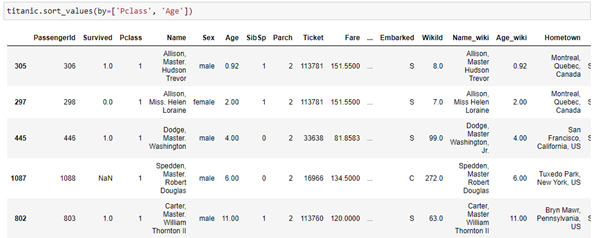

# Pandas

**Summary:** Pandas is an open-source Python package that is heavily used in Data Science and Machine Learning. It utilises Numpy and builds off that basis to support multi-dimensional arrays. 

**Data formats in**  .csv, .xlsx, .json, .html, .xml, .tsv, etc…  
**Data formats out** .csv, .tsv, .json, .html, .xml, .tex,, etc…

**Three tips:**   
1. Changing continuous data to classes can be useful with certain machine learning algorithms or simplifying to present it. With pandas this is really easy using the .cut() method. An example of converting age to various categories is below.  
`age_category = pd.cut(titanic.Age, bins = [0, 5, 16, 30, 60, 85, 210], labels = ['toddler/baby', 'child', 'young_adult', 'adult', 'elderly', 'unknown'])`  
2. Checking the counts of unique values can show if a certain column has just a few classes that the data fits into or each cell is unique or anything in-between. This can be used to get a feel for the dataset itself and is performed with the .nunique() method.  
`df.nunique()`  
3. Sorting values can make a DataFrame more readable to an average person and Pandas lets you sort on multiple columns. This lets you sort on a particular column and if two cells have the same entry, it will sort on the next cell in a different column. Below is an example of the code and the result.  

**Examples of use:** 

**Contribution to data analytics pipeline:** Pandas can be used all across the data analytics pipeline. In the gathering phase in can be used to import data from varying file types. In processing it can be used to clean and merge data. In analysing it can be used to create summary statistics, prepare data for machine learning, create basic exploratory visualisations. In presenting it can be used to make more intricate visualisations however other libraries can also support the DataFrame datatype. Lastly, it can be used to export to a particular file type that can be stored by an individual and reused in the future.  
**Comment on your skill level:** My current level is 7/10. I feel I have a grasp of a lot of the functionality and possibilities within pandas, but I find myself googling a lot of simple functions to remember how to use them. To improve this, I think I should try out some Kaggle challenges and further reinforce my skills and familiarise myself with a few pandas cheat sheets so I can quickly find what I need.