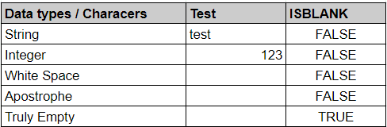

# Spreadsheets

**Summary:** Google Sheets & Microsoft Excel are the two most widely used spreadsheet programs. Google sheets is an online-based software available through a browser or mobile application that allows users to create, modify, export and share data in tabular form online. Microsoft Excel is like Sheets but can also be used as an offline program and can be more useful in certain tasks as it uses the local processing power of your machine.

**Data formats in**  .xls, .xlsx, .csv, .txt, .tsv  
**Data formats out**  xls, .xlsx, csv, .tsv, .pdf, .ods, .html

**Three tips:**  
The following refer to Sheets as I’m more familiar with it but can be extended to Excel with small changes
1. Find and replace is one of the most useful functions in Google Sheets where you can find all cells that match a particular value and replace them with another value. This could for example be used to fix spelling errors. A shortcut to bring this up instead of using the menus above the tables is Crtl+h or ⌘ + Shift + h on mac. 
2. Creating formulas in Google Sheets is essential to automating many tasks however checking them manually for inconsistencies or errors can be very time-consuming. Above the spreadsheet you can click view-show-formulas or press Crtl +  ‘ to view all formulas in the cells instead of the result.
3. Whitespace can cause a myriad of issues in analysing whether a cell is truly empty or not. The ISBLANK function can be used to check if a cell is truly empty or not. This can be used to help analyse missing data.

**Examples of use:**  

**Contribution to data analytics pipeline:** Google sheets is great for the processing, analysing and presenting parts of the pipeline. You can clean and process data using functions and formulas for the processing phase. You can create exploratory/explanatory visualisations and summary statistics for the analysing/presenting phase 

**Comment on your skill level:** My current level is 6/10. I have used mainly other software like OpenRefine or used Pandas for my data cleaning. To get better, I’d need to undertake a project using Sheets or Excel mainly to increase my exposure to it.
